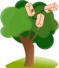

# `x_xy` -- A *tiny* Kinematic Tree Simulator

`x_xy` is a small package for performing
- forward dynamics
- inverse dynamics
- forward kinematics
- inverse kinematics

on a general Kinematic Tree structure. 

It uses nothing but JAX (and flax.struct).

It's meant to be minimalistic and simple. It uses spatial vectors and implements algorithms as proposed by Roy Featherstone. Nameing is heavily inspired by `brax`.

It currently does *not* support
- collisions (i.e. every body is (sort of) transparent)

and probably won't in the near future.
